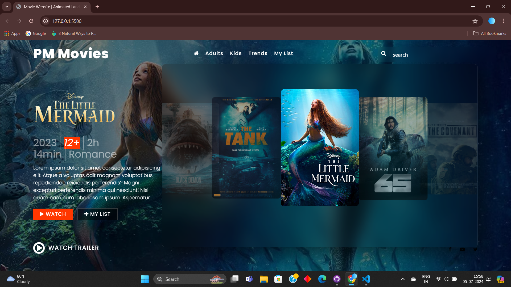
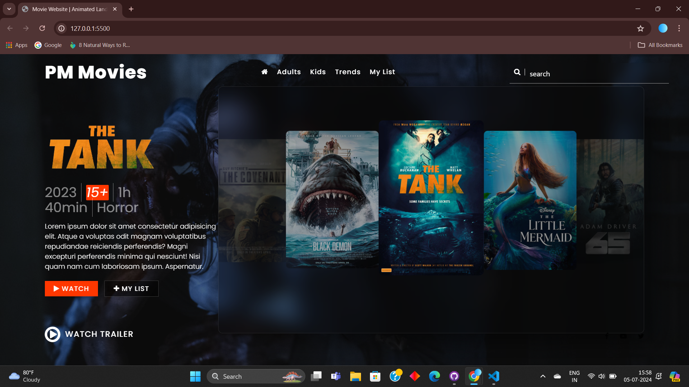

# movie-website
Movie website created with html, css, js
Welcome to the Responsive Movie Website project! This repository contains the source code for a dynamic and interactive movie website built using HTML, CSS, and JavaScript. The main feature of this project is a responsive carousel that allows users to click on a movie slide, which in turn changes the background and title to reflect the selected movie.

Features
Responsive Design: The website is fully responsive, ensuring a seamless experience across different devices and screen sizes.
Dynamic Carousel: Users can interact with a carousel of movie slides. Clicking on a slide updates the background and title to match the selected movie.
Smooth Animations: Enjoy smooth transitions and animations that enhance the user experience.
Modern UI/UX: Clean and modern user interface with an intuitive layout.
Technologies Used
HTML: Structuring the website content.
CSS: Styling the website and ensuring it is responsive.
JavaScript: Adding interactivity to the carousel and updating the content dynamically.

